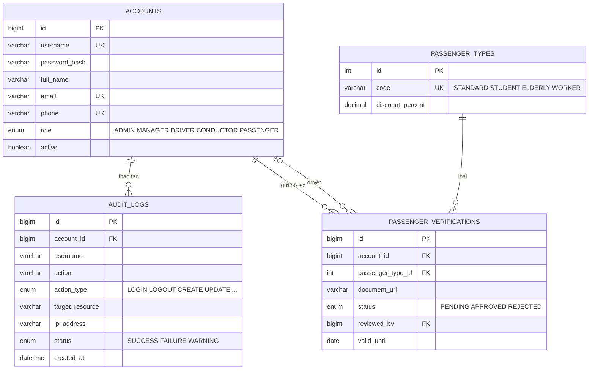
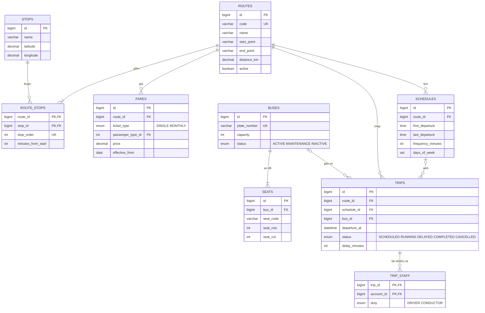
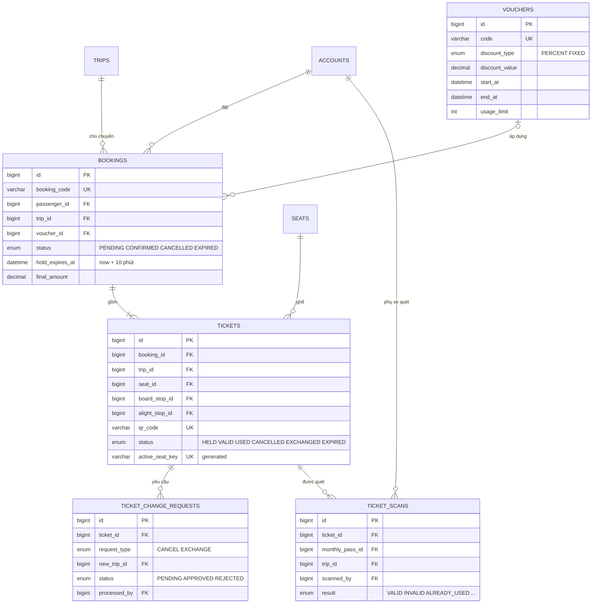
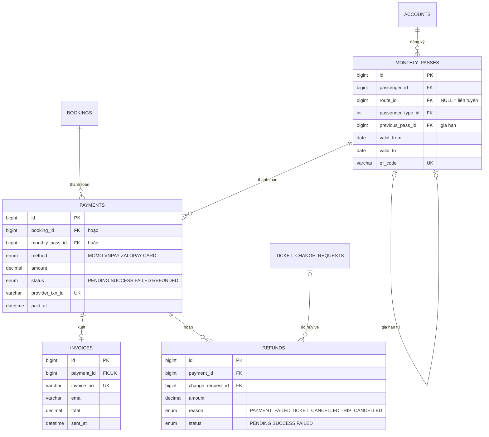
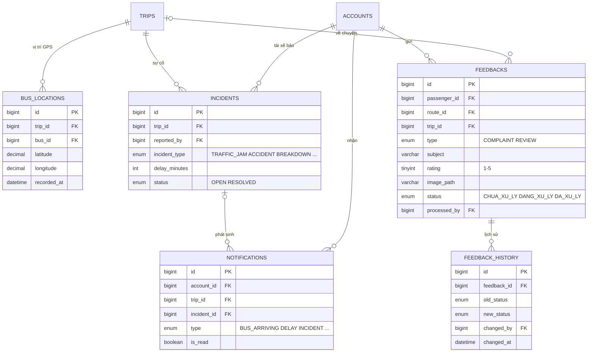

# Thiết kế cơ sở dữ liệu – Smart Bus Ticketing System

- **DBMS:** MySQL 8.0 (utf8mb4) · **Database:** `smart_bus_ticketing`
- **Script:** [`backend/database/schema.sql`](../../backend/database/schema.sql) — 27 bảng, 2 view báo cáo
- **Nguồn:** Product Backlog (24 user story, 7 epic) + model Java hiện có (`Role`, `FeedbackStatus`) + thiết kế `audit_logs`/`feedbacks` của thành viên C (nhánh `feature/thanh-vien-c`)

Chạy thử:

```bash
mysql -u root -p < backend/database/schema.sql
```

## 1. Tài khoản & ưu đãi (US17, US22, US23)



- `role` thêm `CONDUCTOR` (phụ xe, US14–US15) — enum `Role` trong Java cần bổ sung.
- `audit_logs.username` được lưu riêng để nhật ký vẫn đọc được khi tài khoản bị xóa.

## 2. Tuyến, lịch trình & chuyến (US1, US2, US12, US13, US14)



- `route_stops` cho phép một trạm dùng chung nhiều tuyến, thứ tự trạm theo `stop_order`.
- `schedules` là mẫu (giờ đầu/cuối, tần suất); mỗi chuyến chạy thật là một dòng `trips`.
- `UNIQUE(bus_id, departure_at)` chặn gán một xe cho hai chuyến cùng giờ.

## 3. Đặt vé & soát vé (US2–US5, US15, US18)



- **Chống bán trùng ghế:** `tickets.active_seat_key` là cột sinh tự động = `trip-seat` khi vé đang `HELD/VALID/USED`, `NULL` khi hủy. Có `UNIQUE` nên database tự chặn hai người giữ cùng một ghế.
- **Giữ chỗ 10 phút (US3):** tạo booking `PENDING` + vé `HELD`. Backend cần job định kỳ chuyển booking quá `hold_expires_at` sang `EXPIRED` và vé sang `EXPIRED` để nhả ghế.

## 4. Thanh toán & vé tháng (US6–US8, US16, US19, US20)



- `payments` có `CHECK`: mỗi giao dịch thuộc đúng một trong hai (booking **hoặc** vé tháng).
- Báo cáo dùng view: `v_revenue_daily` (doanh thu theo ngày/tuyến), `v_trip_occupancy` (tỷ lệ lấp đầy). Xuất Excel/PDF (US21) làm ở tầng ứng dụng.

## 5. Định vị, sự cố & phản ánh (US9–US11, US24)



- `feedbacks.status` giữ đúng enum `FeedbackStatus` trong code trên `main` (`CHUA_XU_LY / DANG_XU_LY / DA_XU_LY`). Nhánh `feature/thanh-vien-c` đang dùng `PENDING / PROCESSING / RESOLVED` — nhóm cần thống nhất một bộ.

## User story → bảng

| US | Chức năng | Bảng |
|---|---|---|
| 1 | Tra cứu tuyến xe | `routes`, `route_stops`, `stops`, `trips` |
| 2–3 | Chọn ghế, giữ chỗ 10 phút | `seats`, `bookings`, `tickets` |
| 4 | Vé điện tử QR | `tickets.qr_code` |
| 5 | Hủy & đổi vé | `ticket_change_requests` |
| 6–8 | Thanh toán, hóa đơn, hoàn tiền | `payments`, `invoices`, `refunds` |
| 9–11 | Định vị, thông báo, sự cố | `bus_locations`, `notifications`, `incidents` |
| 12 | Tuyến, trạm, giá vé | `routes`, `stops`, `route_stops`, `fares` |
| 13–14 | Lịch trình, phân công | `schedules`, `trips`, `buses`, `trip_staff` |
| 15 | Soát vé QR | `ticket_scans` |
| 16–17 | Vé tháng, duyệt ưu đãi | `monthly_passes`, `passenger_types`, `passenger_verifications` |
| 18 | Voucher | `vouchers`, `bookings.voucher_id` |
| 19–21 | Doanh thu, lấp đầy, xuất file | `v_revenue_daily`, `v_trip_occupancy` |
| 22–23 | Phân quyền, nhật ký | `accounts`, `audit_logs` |
| 24 | Phản ánh, đánh giá | `feedbacks`, `feedback_history` |

## Việc cần làm tiếp ở backend

1. Thêm `CONDUCTOR` vào enum `Role`.
2. Thống nhất kiểu ID: code đang dùng `String`, schema dùng `BIGINT AUTO_INCREMENT`.
3. Thống nhất giá trị trạng thái phản ánh giữa `main` và `feature/thanh-vien-c`.
4. Job nhả ghế khi hết hạn giữ chỗ 10 phút.
